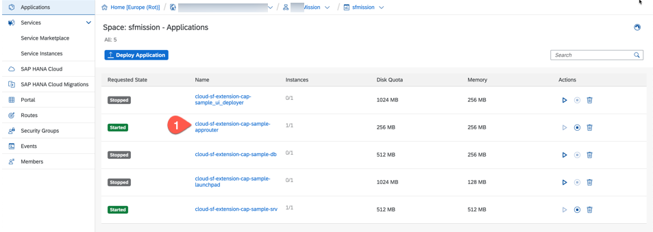
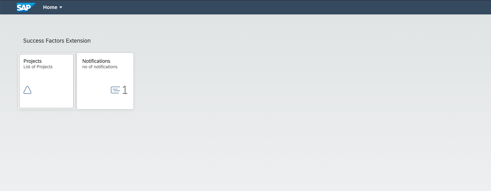
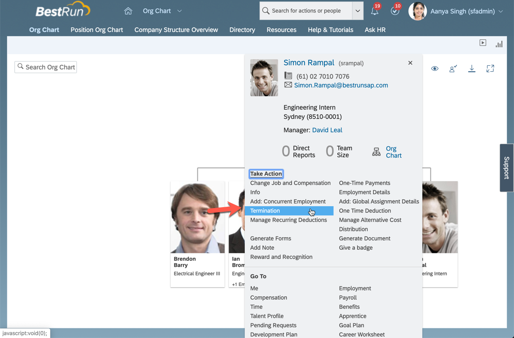
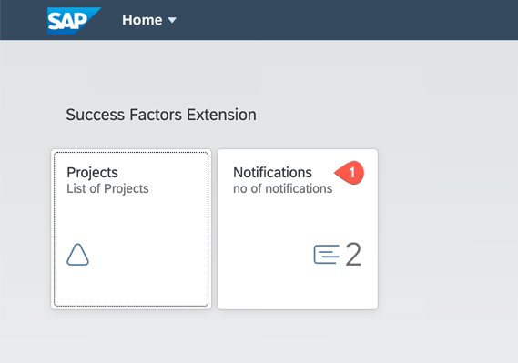

# Testing your scenario by running the Reference Application

## Introduction
Let us now try to test the end to end scenario by triggering an **Employee Termination** event in the SAP SuccessFactors system and then you can view and consume this event in your SAP BTP extension application. To run this scenario you need a SAP SuccessFactors testing system and must have an administrator role. The names of the persons that are used in this tutorial may differ in your system.

**Abbreviation:** SAP Business Technology Platform = SAP BTP

## Step-by-step

1. Login to your SAP BTP global account.
2. Navigate to your sub-account and space where you have deployed your SuccessFactors extension application.
3. Choose **Applications** and then choose the App Routter application, for example: **cloud-sf-extension-cap-sample-approuter**.

   
   
   > If the project is deployed without the SAP Cloud Portal service then form the URL to run your application like below
   >
   >`https://<tenantId>.<appRouterHost>.<domain>/<appName-appVersion>/<resourcePath>`
   >
   >Example:
    ```  https://<approuter-url>/projects-1.0.0/index.html ```
    
4.In the Application Routes section, choose the URL of the application `cloud-sf-extension-cap-sample-approuter`. This URL will launch the extension application.
   
   
  
5. Login with your SAP SuccessFactors username that belongs to a manager. For example, the demo username **dleal (David Leal)** belongs to the fiction employee David Leal who is a manager.

   > You can choose any employee who is a Manager.

6. Choose the **Projects** tile.

   
   
7. Go to the **Projects** tab and choose **Edit**. 

   

8. Choose **Create**. A new entry appears. 
   
   

9. Choose the drop-down in the Employee ID column of the new entry. All employees reporting to David Leal are displayed.

   
   
10. Select an employee, for example Simon Rampal (srampal), and assign him to projects. 

11. **Save** the changes.

12. 14.	Log in to the SAP SuccessFactors demo instance with the SAP SuccessFactors Admin user, in this case the admin user is **sfadmin**.

    
    
13. Search for the employee **David Leal** (dleal) in the Employee Directory.
14. Choose the employee **David Leal**.
15. Click **Actions** > **Jump To** > **Org Chart**.
    
    

16. Choose an employee who is reporting to **David Leal** for example Simon Rampal(srampal) who was assigned to the project in step 12.

17. Choose **Take Action** > **Termination**.
    
    
    
18. Make the following configuration:
      - In the **Termination Date** field, configure a future date. For example, a date one week from the current date
      - In the **Termination Reason**, select **Early Retirement (TERELRT)**
      - In the **OK to Retire field**, select **Yes**
      - In the **Regret Termination** field, select **Yes**
      
        
        
19. Choose **Save**.
20. In the window **Please confirm your request**, choose **Show workflow participants**.
    
21. For the Termination event to get triggered, tow more Workflow participants has to approve this termination. In our demo system, workflow participants are shown as 1. Paul Atkins (Production Director); 2. Tessa Walker (HR Business Partner Global), Christine Dolan (Chief Human Resources Officer). This means that Paul Atkins and Tessa Walker (or Christine Dolan) must approve this request to proceed.
    
22. Choose **Confirm**.
23. You can log in/ask the workflow participants to approve the request. Choose **Proxy Now** and then **Select Target User as Paul Atkins (patkins)** to approve the request.
    
    
    
24. In the Home page of **Paul Atkins** choose **Approve Requests**.
25. Choose **Approve** for the **Early Retirement for Simon Rampal** request.
    
    
    
26. Choose **Proxy Now** and then **Select Target User as Tessa Walker(twalker)** to approve the request.
27. In the Home page of **Tessa Walker**, choose **Approve Requests**.
28. Choose **Approve** for the **Early Retirement of Simon Rampal** request. Now two users have approved the early retirement and an event will be triggered.
29. Switch to the browser window where you have opened the SAP BTP extension application (you opened this app in Step 3).
30. Login with user **David Leal (dleal)** who is a manager.
31. Choose **Notifications**.
    
    
    
32. Notification will be displayed regarding the resignation of Simon Rampal along with his skillset.

    
