# Configure SuccessFactors Backend

## Introduction
   We will see the necessary steps needed for preparing the SuccessFactors backend.
   
## Step-by-Step

### Create Outbound OAuth Configuration

1. Login to your SuccessFactors instance with your username and password.
2. In the search bar, search for Integration and Choose 'Integration Center'.

   

3. In the 'Integration Center', select the tile 'Security Center'.

   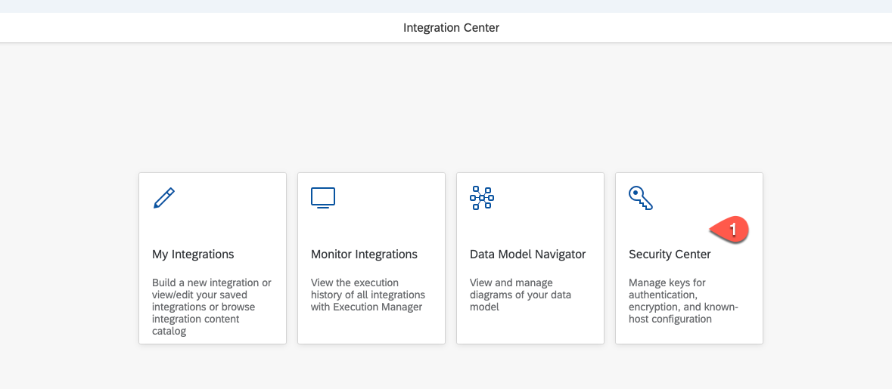

4. Select 'Outbound OAuth Configurations'.

   
   
5. Click 'Add' to create new OAuth configuration.

   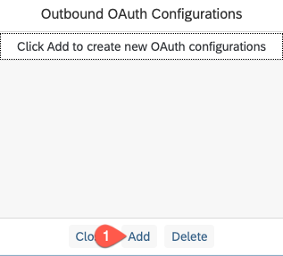
   
6. In the next step, we would configure the OAuth details of the Enterprise messaging instance in the SAP Cloud Platform. To view the service key of the Enterprise messaging instance, see the last step described in [Viewing service key](../ems-config/README.md#generate-service-key). Copy the values of 'Client ID', 'Client Secret' and 'Token endpoint' to a text editor of your choice.
 
7. In the opened screen for adding new OAuth Configuration, enter the following values:		
   - 'Configuration Name' : Enter a meaningful name, example: 'SFMission'
   - 'OAuth Type' : Select 'OAuth 2.0'
   - 'Grant Type' : Select 'Client_Credentials'
   - 'Client ID' : Client id of Enterprise messaging instance copied in previous step
   - 'Client secret' : Client secret of Enterprise messaging instance copied in previous step
   - 'Token URL': Token endpoint url of Enterprise messaging instance copied in previous step
   - Click on 'Add New Row' in Custom Parameters.
   - Enter key as 'x-qos' and Value ='1'
   - Click 'Save' to save the new OAuth Configuration.
   
     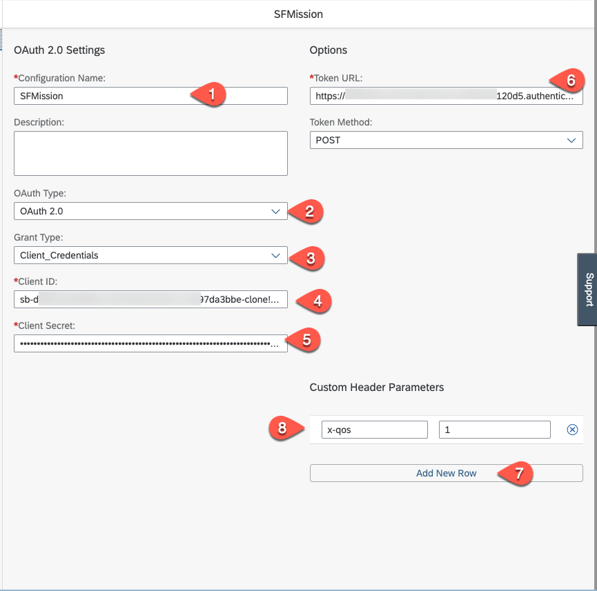

### Create new Integration Trigger Job

1. Again go back to 'Integration Center' and select 'My Integrations'.

   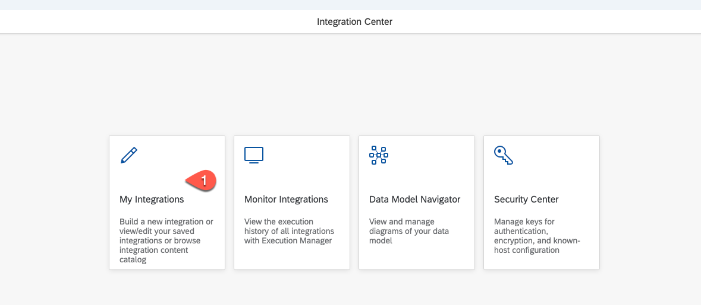
   
2. Click '+ Create' and select 'More Integration Types'.

   
   
3. 	In the opened screen, select the following values:
   - Choose Trigger type: 'Intelligent services'
   - Choose Destination type: 'REST'
   - Select Source Type : 'SuccessFactors'
   - Choose Format: JSON
   - Click 'Create'.

     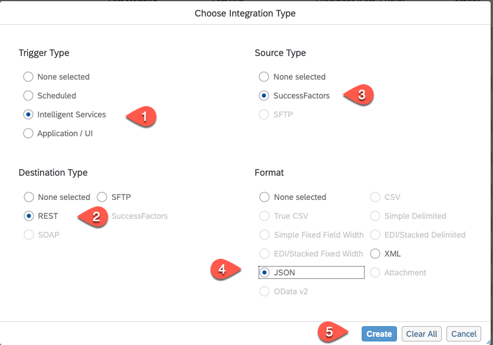
     
4. In the next page, search for the event, 'Employment Termination' and click on the event 'Employment Termination' and click 'Select'.

   
   
5. Enter a meaningful name for 'Integration Name' for ex: 'Emp Termination' and Description as 'SF Mission' and click 'Next'.

   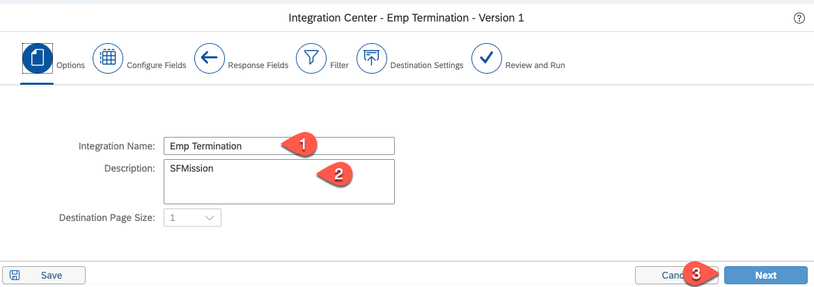
   
6. Click the '+' button to configure fields and Select 'Insert sibling element'

   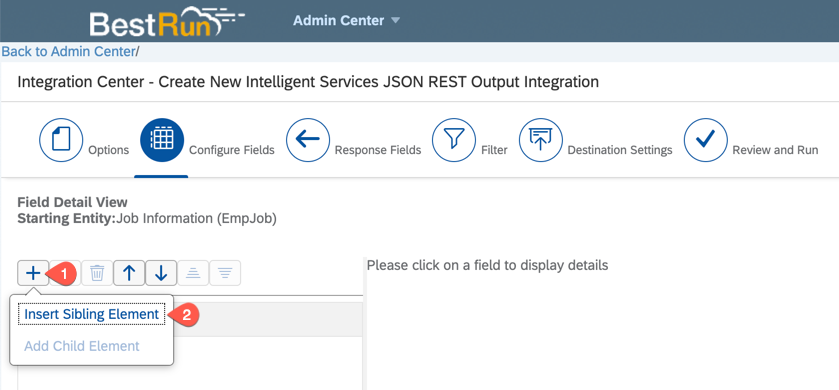
   
7. Click on the element created and in the detailed view of the element, enter label as 'employeeId' and Click the button with tooltip 'Set as Association Field' as shown in screenshot.

   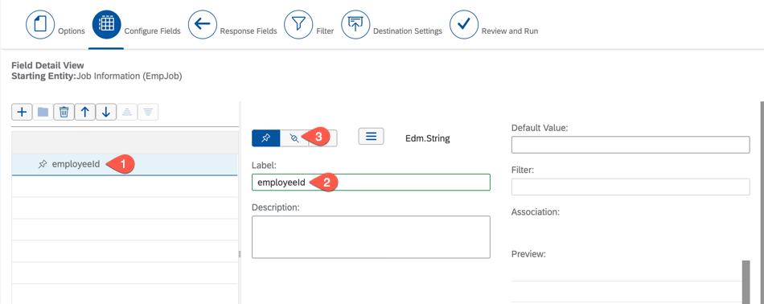
   
8. Expand 'Entity Tree View' and Select 'User ID' and Click the button 'Change Association to User ID'.

   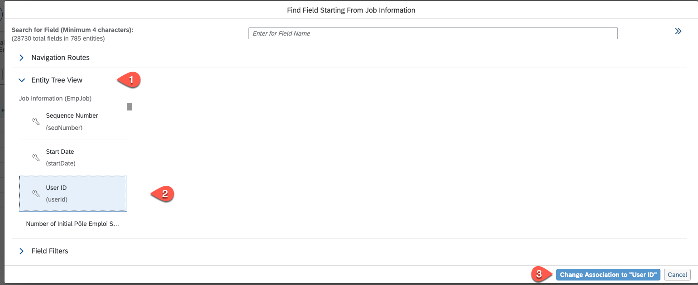
   
9. Click on the '+' button like in step 6 to add another new field and select 'Insert sibling element'.
10. Click on the element created	and in the detailed view of the element, enter label as 'managerId' and Click the button 'Set as Association Field'.

    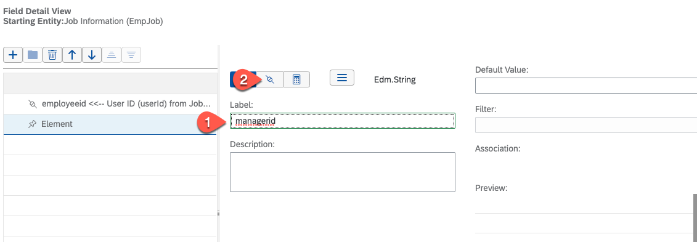
    
11. Search for 'supervisor' and from the searched list, choose 'Supervisor (managerId) in Job Information (EmpJob)' and select 'Supervisor' and Click 'Change Association to Supervisor Id'.

    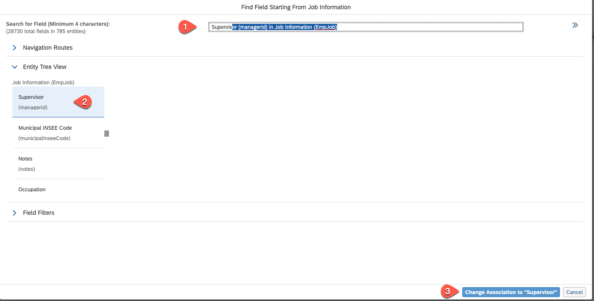
    
12. Click on the '+' button like in step 6 to add another new field and select 'Insert sibling element'.
13. Click on the element created and in the detailed view of the element, enter label as 'message' and enter Default value as 'Resigned' and Click 'Next'.

    
    
14. Click 'Next' for the tab 'Response Fields' and Click Next' for the tab 'Filter'.
15. Select Authentication Type as 'Oauth' and in the drop-down for OAuth Configurations, select the previously created OAuth Configuration.

    
    
16. Construct the REST API URL link as shown below :
    - Give the Base url of the queue which was copied from Enterprise Message Service Key in step 4.10 E.g For Europe Region Account it could be 'https://enterprise-messaging-pubsub.cfapps.eu10.hana.ondemand.com/messagingrest/v1/topics/<topicName>/messages'. Use the topic name copied from the Subscriptions in Enterprise Messaging Application. Note that the topic name be used after double encoding.
For example, if your topic name is sfext/sf/sample/myMessaging/d41d/sfemessage, then the / should be replaced with %252F. The resultant topic name will be sfext%252Fsf%252Fsample%252FmyMessaging%252Fd41d%252Fsfemessage.'
In the end our final URL looks like : 'https://enterprise-messaging-pubsub.cfapps.eu10.hana.ondemand.com/messagingrest/v1/topics/eccorg%252Fsfmission%252Fabcd%252FPLTUserManagement%252Fd41d%252Fsfemessage/messages'

    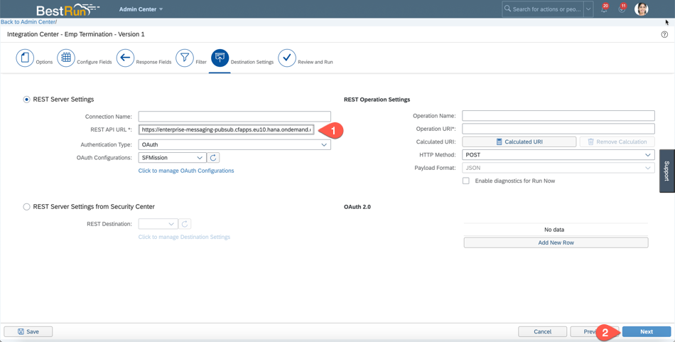 

17. Click on 'Next'.
18. Click on 'Save' and if any pop up comes up, click on 'Save/OK'.
    
    
    
19. In Review and Run tab - click on 'Run now'.

    
    
20. You should see a 'Success' message that the integration job was submitted.

    

### Consume event when published 	
1. Search for 'Intelligent' and choose 'Intelligent Services Center'

   
   
2. Search for 'Employment' and click on the 'Employment Termination' event.

   
   
3. In the right side of the screen, Click on Custom Activities> Integration.

   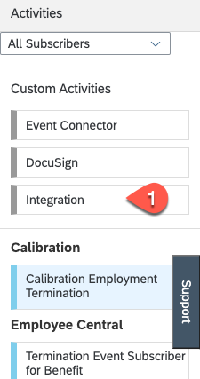
   
4. There is a popup for selecting Integration.
5. 	Choose the created Integration and Click on 'Add Integration'.

   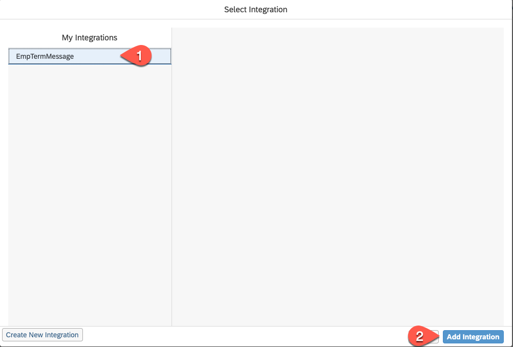
   
6. 	Now let us change the setting to consume event when an event is published.
7. Scroll down to the list and select the Integration created by you with Source as 'Integration Center' and change the Timing as 'When event is published' from the list. Click 'Actions'(top of page).

   
   
8. Click 'Save Flow'.

   	