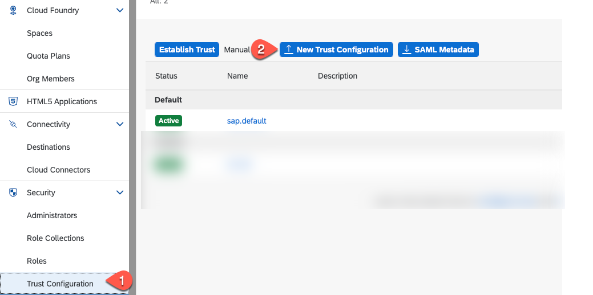
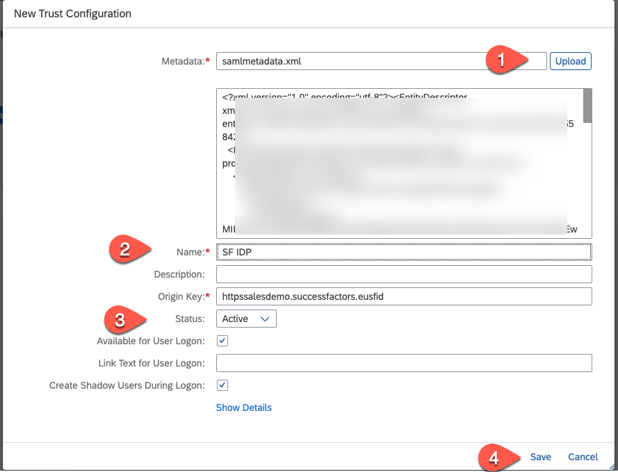
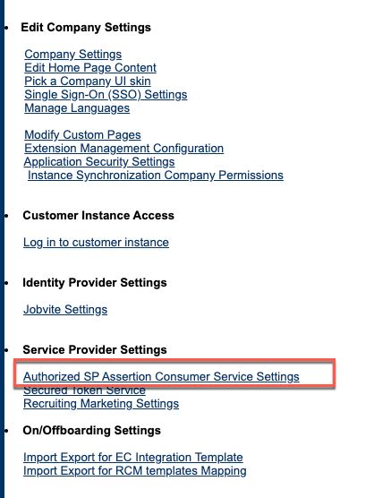
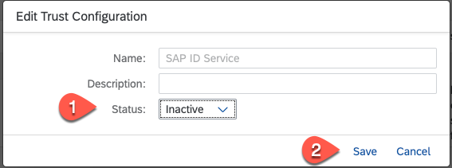
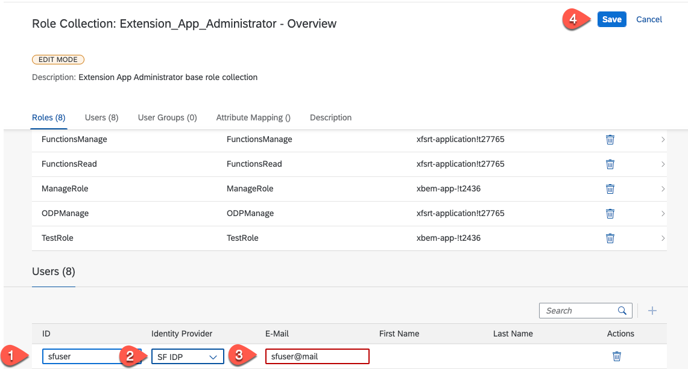
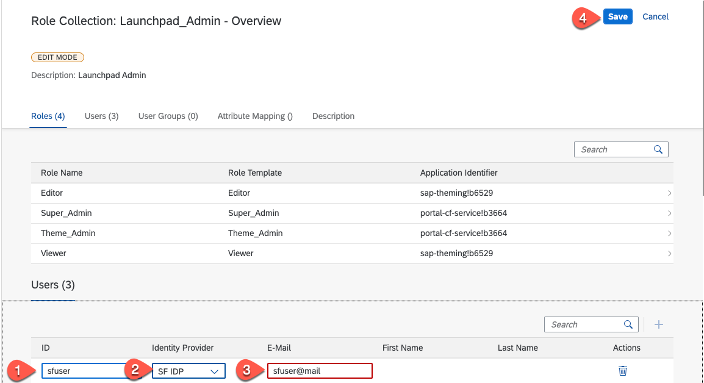
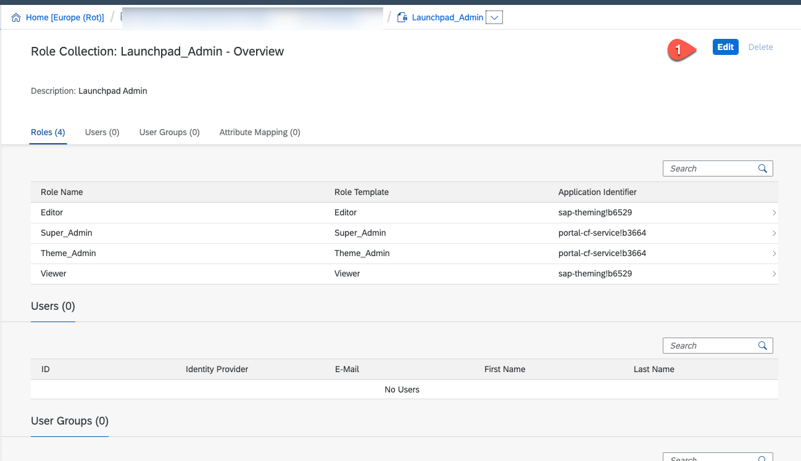

# Setup Connection and Trust between your SAP Cloud Platform Account and the SAP SuccessFactors Account

To ensure the required security for accessing the SAP Cloud extension applications, you need to configure the single sign-on (SSO) between the SAP Cloud Platform subaccount and the SAP SuccessFactors system using a SAML identity provider. The SSO requires both solutions to be configured as trusted SAML service providers for the identity provider.

For this mission we will use the SAP SuccessFactors Identiy Provider.

Persona: 
* **SAP Cloud Platform Administrator**
* **SAP SuccessFactors Administrator**

## Setup SAP SuccessFactors System for SAP Cloud Platform

To connect to a SAP SuccessFactors system we first have to register it at the SAP Cloud Platform global account.

1. Create a new SAP SucessFactors System
   * Go to your global SAP Cloud Account and select Systems
   * Click on Register System
   * Set a system Name - we will need this name in later section.
   * Select SAP SuccessFactors as type
   * Click on Register 
   
   

2. In the Register System pop-up copy the generated token to a local file and close the window. The status of the SAP SuccessFactors system is now pending.
   
   

3. Go to your SAP SuccessFactors Provisioning Tool Home Page. Select your company.
   
   

4. In the Edit Company Settings click on Extension Management Configuration
   
   

5. In the Add New Integration section insert the token from your SAP Cloud Platform account and click on add
   
   
   
6. At your SAP Cloud Platform account the system should now have ths status "Registered"
   
   

## Create Entitlement for SuccessFactors Extensibility

After creating the SuccessFactors System we are now able to create an entitlement for the SuccessFactors Extensibility service.
1. In your SAP Cloud Platform subaccount select Entitlements. Click on Configure Entitlements and then on Add Service Plans.
 
   
   

2. Select SAP SuccessFactors Extensibility. Select the SuccessFactors system you have created in the section before. Check the api-access plan. Press Add Service Plan.
   
   

3. Save the new entitlement
   
   

## Setup Trust for SAP SuccessFactors Identity Provider

Establishing a trust is done be exchanging the SAML certificate of each system.

1. Get the SAP SuccesFactors SAML metadata file
   * Go to https://<sap_successfactors_system>/idp/samlmetadata?company=<company_id> where:
     - <sap_successfactors_system> is the hostname SuccessFactors system
     - <company_id> is the ID of your SAP SuccessFactors company
   * Save this file on your local system and change its extension to .xml 

2.  Go to the SAP Cloud Platform subaccount which you have created for this mission. 
    * Select Security - Trust Configuration
    * Click on New Trust Configuration
   
     
   
    
3. New Trust Configuration

   * Upload the SAP SuccessFactors SAML metadata.xml
   * Set a name for the IDP
   * Set the status = active
   * Save your configuration 
   
    

4.  Get the SAP Cloud Platform SAML Metadata and save it on your local system.

    

5.  Open this .xml file in a text editior - we need some values of it for the next step.

6.  Again go to your SAP SuccessFactors Provisioning Tool Home Page. Select Authorized SP Consumer Service Settings
   
    

7. Service Provider ACS Setup
   
    

 
   * Click on "Add another Service Provider ACS"
   * In the "Assertion Consumer Service" field enter the Location URL with the HTTP-POST binding from the SAP Cloud Platform metadata.xml

      

   * In the "Logout Url" field enter the Location URL of the SingleLogoutService element with the HTTP-POST binding
   
      

   
   * In the "Audience Url" field enter the value of the entityID from the EntityDescriptor section
  
      

   * Click on Save
  
8. Back to your SAP Cloud Platform subaccount. In the trust configuration we have now to disable the Default IDP. Select configuration. In the popup set the Status = Inactive. Press Save

    
    
    

9. Now we have to map our SuccessFactors user to the SAP Cloud Platform User roles. Select Role Collections and click on the  Extension_App_Administrator role collection.

    

10. Click on Edit and enter all SuccessFactors user who need the administrator role for the app extension. Enter the SuccessFactors user ID select the SuccessFactors IDP and enter the users email address. Click on Save
    
    

11. Repeat the same for the Extension_App_Developer role collection - add all SuccessFactors users that need the development privilege.

12. In addition we also need to add the administration users to the Launchpad Admin role collection.
    
    

    

13. Click 'Security' and 'Role Collections' and click on the role 'Launchpad Admin'.
   
   
14. Click on 'Edit'.
   
   

15. In the 'Users' section, add the users from the SuccessFactors Identity Provider who you want to have Launchpad Admin roles. Click on 'Save'.

   

16. Now you have assigned relevant users from your SuccessFactors a

We have finished the system and trust setup.
